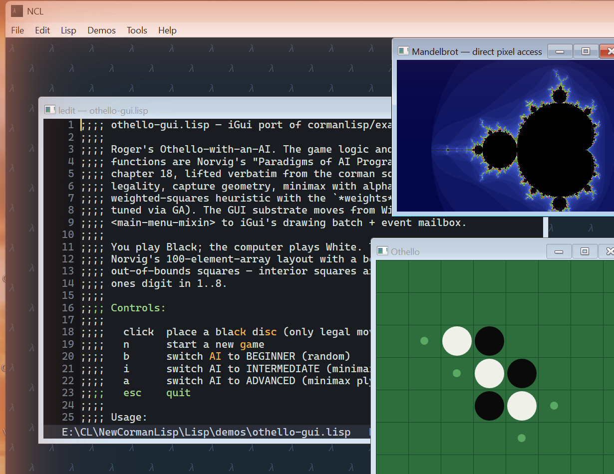

# NCL 

### !Beware this compiler and GC are all new ###


A from-scratch reimplementation of the Common Lisp / Corman Lisp **language and
user-facing experience** — Rust core, LLVM-based JIT, 64-bit,
Windows-first with a Mac port planned.

NCL ports some Corman Lisp source code and demos. It does not run
the original implementation's compiled artifacts (`.img`, `.fasl`).
Recompile from source.

See [MANIFESTO.md](MANIFESTO.md) for the design and what we have
committed to. This file will fill in as the system grows; the
manifesto is the spec.



## Status

**Working JIT-compiled Common Lisp** (v0.0.0 — pre-1.0; internals and
interfaces still move). NCL self-hosts its standard library and runs real
programs. It is **not** a complete ANSI implementation yet — see
*Conformance* and *Known gaps* below.

### What works

- **Compiler** — JIT-first, no interpreter. Lisp → IR → LLVM MCJIT (`-O2`),
  compiled per function. Optimization passes: self-tail-call elimination,
  unboxed `double-float` representation inference, no-capture closure
  elision, and IR-level inlining of `declaim inline` functions.
- **Runtime / GC** — a custom generational page-heap collector (G0 / G1 /
  Tenured), multi-mutator, with conservative stack pinning plus a precise
  inline root stack and card marking.
- **Language** — the numeric tower (fixnum, bignum, ratio, double-float,
  complex); the full macro system (`defmacro`, `macrolet`,
  `symbol-macrolet`, `&environment`); the condition system
  (`handler-case`, `unwind-protect`, restarts); CLOS (`defclass`,
  `defmethod`, generic dispatch; closette-derived); `format`, sequences,
  lists, strings, hash tables, structures.
- **GUI (Windows)** — *iGui*, a Direct2D MDI shell with a pixel canvas,
  menus, and a tick/event loop. Demos include a live neural-net + genetic
  algorithm tank simulation and assorted animation demos.
- **Standard library** — ~800 forms, JIT-compiled at startup from
  `Lisp/core.lisp` (embedded) + `clos.lisp` + `Library/` (loaded from disk,
  user-extensible).

### Performance

The yardstick is **SBCL** — the mature, gold-standard CL compiler, and it
is *much* faster than NCL. That's expected: SBCL has 20+ years of native
codegen and GC tuning. The goal for a young, from-scratch JIT is to stay
**within an order of magnitude**, and on a real workload we now do. Honest
numbers (2026-06, same machine, SBCL 2.6.5):

- **Symbolic / heavy-backtracking** (Norvig Prolog solving the Zebra
  puzzle, `demos/prolog.lisp`): **SBCL is ~6× faster** — SBCL ~0.10 s vs
  NCL ~0.59 s (`bench/zebra-time.lisp`; SBCL via `bench/zebra-sbcl.lisp`).
  This used to be ~10×: two stdlib/compiler fixes closed the gap. (1) The
  hash-table walks (`gethash` & friends) were `(loop …)`, which lowers to a
  body-thunk closure that `ncl_make_closure` allocates in the immortal
  static area *per call* — `typep`→`gethash` runs on every type check, so
  the Zebra solve leaked ~2 M closures (~95 MB) and triggered three
  expensive promoting GCs. Rewriting those loops as self-tail-recursion
  (no thunk) eliminated the leak and the GCs. (2) `symbolp` is now a
  tag-check intrinsic (like `consp`/`atom`/`listp`/`null`) instead of
  `(typep x 'symbol)`, removing ~1 M hash lookups from the unifier's hot
  path. Net: 2.9 s → 0.59 s, and the solve now runs with **zero GC cycles**.
- **Float kernels**: NCL's unboxing pass makes its *own* code ~3–4× faster
  (it matches a hand `(declare (double-float …))` without the declaration).
- Allocation is competitive — `cons` is only ~2× slower than SBCL — and GC
  is usually *not* the bottleneck. The dominant remaining gap is per-call
  overhead: NCL's function calls are ~18× SBCL's, from a late-bound, boxed
  calling convention. The next compiler lever is an unboxed / known-call
  ABI to close that. A known leak also remains: any non-inlined
  `loop`/`block`/`unwind-protect`/`catch` body-thunk is still allocated in
  the immortal static area (escape analysis to young-allocate or elide them
  is future work).

### Conformance

The Corman/ANSI test chapters (`demos/ansi-runner.lisp`) currently pass
**≈757 / fail ≈83 / error ≈79** of **919 forms run** (up from ≈622 with three
chapters aborting). The suite now **loads every chapter to completion** — no
chapter-killer aborts and no worker-thread panics — so the gaps are honest
*failures/errors on forms that actually executed*, not whole chapters hidden
behind one unread construct. Recently landed: LOOP's full conditional
sublanguage (`else`/`it`/`end`/nested, parallel `and`-`for`, `loop-finish`),
`#S` literals, explicit-keyword `&key`, a from-scratch `defstruct` with the
full option-list surface (`:conc-name` / `:include` / `:type list` /
`:constructor` + BOA / `:copier` / `:predicate` / per-slot options), the
setf-expander protocol (`define-setf-expander` / `get-setf-expansion`,
once-only `push`/`pop`/`rotatef`/`shiftf`), `multiple-value-call`,
`function-lambda-expression`, and catchable `aref`. The remaining work is
tracked in [docs/ansi-killers.md](docs/ansi-killers.md): **multidimensional
arrays** (`make-array` on a dimension list + N-index `aref`), struct⇄print
parity (NCL prints structs as `SIMPLE-VECTOR`, so `=> #S(...)` comparisons
still differ), the `getf` / `ldb` setf places, and parts of the type system
(`subtypep`, compound `typep`). The performance
"gauntlet" (`bench/gauntlet.lisp`) is ALL-PASS.

### Known gaps

- Not a complete ANSI CL (see *Conformance*).
- Windows-only today; the Mac port is planned, not started.
- No image / fasl save-and-load — recompile from source.
- Some GC roots are found conservatively (precise stack maps are future
  work).

## Building & running

### Step 1 — Rust toolchain

Install Rust stable via [rustup](https://rustup.rs/). NCL requires the
**2024 edition** (stable 1.85 or later).

### Step 2 — LLVM 22.1

NCL's JIT backend links against **LLVM 22.1** via `llvm-sys`. This is the
only prerequisite not bundled in the repo.

**Option A — download a pre-built release** (quickest):
Download the LLVM 22.1.x release archive from
https://github.com/llvm/llvm-project/releases and unpack it. You only
need the `include/`, `lib/`, and `bin/` directories (the `LLVM-C` shared
library / import lib + headers). A trimmed install is fine; you do not
need Clang or the LLVM tools themselves.

**Option B — build LLVM from source** (full control, takes ~30 min):
```
cmake -S llvm -B build -G Ninja \
      -DCMAKE_BUILD_TYPE=Release \
      -DLLVM_TARGETS_TO_BUILD=X86 \
      -DLLVM_BUILD_LLVM_DYLIB=ON \
      -DCMAKE_INSTALL_PREFIX=/path/to/install
cmake --build build --target install
```

Once you have the install directory, point `llvm-sys` at it by setting
an environment variable **before** running `cargo build`:

```
# Windows — set permanently (takes effect in new shells):
setx LLVM_SYS_221_PREFIX "C:\path\to\llvm22\install"

# Windows — current session only:
$env:LLVM_SYS_221_PREFIX = "C:\path\to\llvm22\install"

# Linux / macOS:
export LLVM_SYS_221_PREFIX=/path/to/llvm22/install
```

The variable name encodes the major version (`221` = LLVM 22.1). If you
get a build error like *"No suitable version of LLVM was found"*, this
variable is either unset or points at the wrong directory.

### Step 3 — clone and build

Everything else is in this repo. No sibling projects, no extra git
fetches — all Rust crates (GC engine, audio, doc renderer, ASM helpers)
are vendored under `crates/`, and `cargo` fetches crates.io deps
automatically.

```
git clone https://github.com/albanread/NewCL.git
cd NewCL

# Console REPL / batch runner:
cargo build --release
# → target/release/ncl.exe  (Windows)  /  target/release/ncl  (Linux)

# Windows GUI build (MDI shell, iGui, Direct2D):
cargo build --release --features gui-app -p ncl-driver
# → target/release/ncl.exe
```

### Running

```
# Interactive REPL:
ncl.exe

# Load and run a Lisp file:
ncl.exe -l demos/prolog.lisp

# Run the ANSI conformance suite:
ncl.exe -l demos/ansi-runner.lisp

# Timed benchmark:
ncl.exe -l bench/zebra-time.lisp
```

In a packaged release the console binary is `nclterm.exe` and the GUI
binary is `ncl.exe`.

### Repository layout

```
src/          NCL compiler, runtime, reader, LLVM codegen, loader, driver
Lisp/         Standard library: core.lisp (embedded) + Library/ (disk-loaded)
crates/       Vendored dependencies (all in-repo, no external paths needed)
  newgc-core      Generational page-heap GC engine
  new-asm         Shared ASM-procedure helpers for JIT crates
  newaudio*       PCM synthesis + ABC parser + Windows waveOut mixer
  docpane         Direct2D markdown + Mermaid diagram renderer
  selkie          Mermaid diagram parser (text → IR)
  doc-crate       Headless doc-snapshot tool (CI / review aid)
demos/        Runnable Lisp programs and the ANSI test runner
bench/        Benchmark scripts
docs/         Design notes and conformance tracking
```
