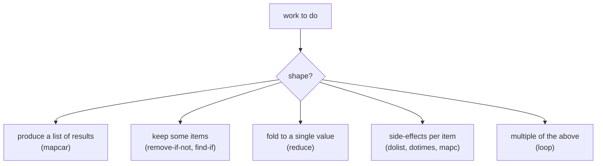

# Control flow

Common Lisp's control flow falls into three groups: **conditionals**
(`if`, `cond`, `case`, `when`, `unless`), **iteration** (`loop`,
`dotimes`, `dolist`, `do`), and **non-local exits** (`block`,
`return-from`, `tagbody`, `go`, `catch`, `throw`). Almost every
imperative program shape you know has an idiomatic Lisp expression.

## Conditionals

### `if`

The fundamental two-armed choice. `if` is an *expression* — it
returns the value of whichever branch ran.

```lisp
> (if (> 3 2) 'yes 'no)        => YES
> (if (> 2 3) 'yes 'no)        => NO
> (if (> 2 3) 'yes)            => NIL          ; else branch is optional
```

`nil` and `()` mean false; *every other value* (including `0`,
`""`, `'(0)`) is true. The convention symbol for true is `t`, but
"true" really means "not nil."

### `when` and `unless`

One-armed conditionals that also let you sequence multiple body forms
without a `progn`.

```lisp
> (when (logged-in-p) (refresh-cache) (display-page))
> (unless (cache-warm-p) (warm-cache))
```

`when` is `(if test (progn body...))`. `unless` is the opposite.

### `cond`

The multi-armed choice. Each clause is `(test body...)`; the first
test that returns non-`nil` wins.

```lisp
> (defun classify (n)
    (cond ((minusp n) 'negative)
          ((zerop n)  'zero)
          ((evenp n)  'positive-even)
          (t          'positive-odd)))
CLASSIFY
> (classify -3)                => NEGATIVE
> (classify 0)                 => ZERO
> (classify 7)                 => POSITIVE-ODD
```

The final `t` clause is the catch-all — it always matches. If no
clause matches, `cond` returns `nil`.

### `case`

`case` dispatches on a single value, compared with `eql`.

```lisp
> (defun shape-edges (shape)
    (case shape
      (triangle 3)
      ((square rectangle) 4)
      (pentagon 5)
      (otherwise 'unknown)))
SHAPE-EDGES
> (shape-edges 'triangle)      => 3
> (shape-edges 'square)        => 4
> (shape-edges 'circle)        => UNKNOWN
```

The keys can be a single value or a list of values. `otherwise` (or
`t`) is the default. `case` compiles to a jump table when the keys
are dense, so it's also the fast way to dispatch.

## Iteration

### `dotimes` and `dolist`

The two shortest counted loops in the language.

```lisp
> (dotimes (i 5) (print i))
0 1 2 3 4
NIL

> (dolist (x '(a b c)) (print x))
A B C
NIL
```

The `dotimes` variable goes from `0` to `n-1`. Both forms accept an
optional return value:

```lisp
> (dotimes (i 5 'done) (print i))
0 1 2 3 4
DONE

> (dolist (x '(a b c) (length '(a b c))) (print x))
A B C
3
```

When you want to *accumulate* into a list while iterating, the
`push` + `nreverse` pattern is canonical:

```lisp
> (let ((squares nil))
    (dotimes (i 5) (push (* i i) squares))
    (nreverse squares))
(0 1 4 9 16)
```

For most "build a list" cases, `mapcar` or `loop` is shorter.

### `loop`

`loop` is a sublanguage. It looks unlike anything else in CL,
because it *is* unlike anything else. Read it left to right like
English:

```lisp
> (loop for i from 1 to 10 collect (* i i))
(1 4 9 16 25 36 49 64 81 100)

> (loop for i from 1 to 10
        when (oddp i)
        collect (* i i))
(1 9 25 49 81)

> (loop for x in '(a b c d e)
        for i from 0
        collect (list i x))
((0 A) (1 B) (2 C) (3 D) (4 E))

> (loop for k being the hash-keys of *table* collect k)
```

Common clauses:

| Clause                          | What it does                          |
|---------------------------------|---------------------------------------|
| `for i from n to m`             | counted, inclusive                    |
| `for i from n below m`          | counted, exclusive                    |
| `for i from n to m by k`        | counted with step                     |
| `for x in list`                 | element-by-element                    |
| `for cell on list`              | tail-by-tail (each successive cdr)    |
| `for k being the hash-keys of h` | hash table keys                      |
| `collect x`                     | accumulate into a list                |
| `sum x`                         | sum up                                |
| `count test`                    | count matches                         |
| `maximize x`, `minimize x`      | running max/min                       |
| `when test`                     | conditional accumulation              |
| `do body...`                    | side-effects                          |
| `while test`, `until test`      | stop conditions                       |
| `finally body...`               | run after the loop                    |
| `return value`                  | early exit with a result              |

`loop` is divisive — some Lispers consider it un-Lispy. In NCL we
embrace it. Anything that turns three nested `do` blocks into one
readable line earns its keep.

### `do`

The classical iteration form, mostly displaced by `loop`. Still
useful when you want explicit step expressions:

```lisp
> (do ((i 0 (1+ i))
       (acc nil (cons (* i i) acc)))
      ((= i 5) (nreverse acc)))
(0 1 4 9 16)
```

Read it as: bind `i = 0` and `acc = nil`; on each iteration, step
`i` to `(1+ i)` and `acc` to `(cons ...)`; when `(= i 5)`, return
`(nreverse acc)`. No body needed — the work is in the step
expressions. `do*` is the sequential cousin (like `let*`).

### A picture of the dispatch



If your job fits one of the simple boxes, use the matching
operator. If two or more, use `loop`.

## Non-local exits

Sometimes you need to break out of nested code without unwinding by
hand. CL has three layers.

### `block` and `return-from`

A `block` is a labeled scope. `return-from` jumps out.

```lisp
> (block find-it
    (dolist (x '(1 2 3 4 5))
      (when (= x 3) (return-from find-it x))))
3
```

Every `defun` wraps its body in an implicit `block` whose name is
the function name, so this just works:

```lisp
> (defun find-3 (lst)
    (dolist (x lst)
      (when (= x 3) (return-from find-3 x))))
FIND-3
> (find-3 '(7 2 3 9))         => 3
```

`return` (without `-from`) returns from the *innermost* anonymous
block, which `dolist`, `dotimes`, and `loop` implicitly set up:

```lisp
> (dolist (x '(1 2 3 4))
    (when (> x 2) (return x)))
3
```

### `tagbody` and `go`

The lowest-level construct: a labeled-statement body with explicit
`goto`. You will almost never write `tagbody` directly, but
*understanding* it is useful because every `loop` and `dotimes`
expands into one.

```lisp
(tagbody
   start
     (when (zerop n) (go done))
     (decf n)
     (go start)
   done)
```

Reach for this only when the iteration shape doesn't fit any of
the higher-level forms (a state machine, a goto-driven port from
another language).

### `catch` and `throw`

Like `block` / `return-from`, but the target is matched dynamically
by tag value rather than lexically by name.

```lisp
> (catch 'gotcha
    (mapcar (lambda (x)
              (when (eql x 'stop) (throw 'gotcha 'found)))
            '(1 2 stop 4))
    'not-found)
FOUND
```

Use `catch` / `throw` when the form that signals is far from the
form that handles, and the relationship isn't visible
syntactically. For most "ran into an unexpected state" situations,
`error` + `handler-case` is cleaner — see [conditions](#) when that
chapter lands.

## Sequencing without conditions

A few small primitives for grouping expressions:

```lisp
> (progn 1 2 3)               => 3        ; evaluate all, return last
> (prog1 1 2 3)               => 1        ; evaluate all, return first
> (prog2 1 2 3)               => 2        ; evaluate all, return second
```

`progn` is the workhorse. Most special forms (`when`, `let`, `defun`,
the loop body) accept multiple body expressions implicitly — that's a
hidden `progn`.

## Putting it together

A common shape: search, exit early with a result, default if nothing
matched.

```lisp
(defun first-even (lst)
  (dolist (x lst nil)        ; default return = nil
    (when (evenp x) (return x))))

> (first-even '(1 3 5 6 7))   => 6
> (first-even '(1 3 5 7))     => NIL
```

The three-argument form of `dolist` makes this read as one
sentence. The equivalent `loop`:

```lisp
(defun first-even (lst)
  (loop for x in lst
        when (evenp x) return x))
```

Both are good. Pick whichever your future self will read faster.

## What's next

- **[Functions](functions.md)** — where the bodies these forms
  control actually live.
- **[Macros](macros.md)** — how `loop`, `when`, `dotimes`, and
  friends are built on top of `if`, `block`, and `tagbody`.
- **[Lists](lists.md)** — most of the iteration above is over
  lists.
