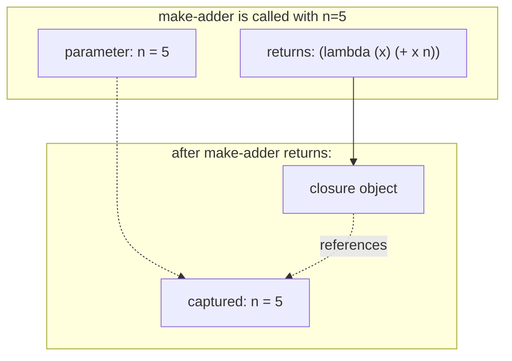

# Functions

Functions in Lisp are first-class values: you can pass them as
arguments, return them from other functions, put them in lists,
store them in variables. Most of the standard library is built that
way — `mapcar`, `reduce`, `sort`, and friends take other functions
as parameters and would be useless otherwise.

## `defun`

`defun` defines a named, top-level function.

```lisp
> (defun square (x) (* x x))
SQUARE
> (square 5)              => 25

> (defun greet (name)
    "Greet the named person."
    (format t "Hello, ~A!~%" name))
GREET
> (greet "world")
Hello, world!
NIL
```

The body can be any number of expressions; the value of the last one
is what the function returns. An optional string just after the
parameter list is the *docstring* — `(documentation 'square 'function)`
gives it back, and the integrated editor surfaces it on hover.

## Lambda lists

The parameter list is called the *lambda list*. Beyond plain
positional parameters, it accepts four kinds of markers:

| Marker      | Effect                                     |
|-------------|--------------------------------------------|
| `&optional` | trailing positional, may be omitted        |
| `&rest`     | bind the rest as a list                    |
| `&key`      | named-argument parameters                  |
| `&aux`      | local bindings (like a `let` at top of body) |

### `&optional`

```lisp
> (defun greet (name &optional (greeting "Hello"))
    (format t "~A, ~A!~%" greeting name))
GREET
> (greet "Alice")           ; uses default greeting
Hello, Alice!
> (greet "Alice" "Howdy")
Howdy, Alice!
```

The `(greeting "Hello")` form gives a default. Without the default
form, an omitted optional parameter is bound to `nil`.

### `&rest`

```lisp
> (defun average (&rest numbers)
    (if numbers
        (/ (apply #'+ numbers) (length numbers))
        0))
AVERAGE
> (average 1 2 3 4)        => 5/2
> (average 1.0 2.0 3.0 4.0) => 2.5
> (average)                => 0
```

`&rest` captures *all remaining arguments* as a list. `apply` is the
inverse: it spreads a list back out as arguments.

### `&key`

```lisp
> (defun make-window (&key (title "Untitled") (width 800) (height 600))
    (list :title title :w width :h height))
MAKE-WINDOW
> (make-window :title "Hello")
(:TITLE "Hello" :W 800 :H 600)
> (make-window :width 1024 :height 768)
(:TITLE "Untitled" :W 1024 :H 768)
> (make-window :title "App" :width 1280)
(:TITLE "App" :W 1280 :H 600)
```

Keyword arguments are looked up by name. They can appear in any
order; defaults apply to the ones you don't supply. The keyword in
the call is the parameter name preceded by `:`.

You can combine them all, in this order:

```lisp
(defun example (req1 req2 &optional (opt1 nil) &rest rest &key (k 0))
  ...)
```

That's reading: two required, one optional, then any extras
captured as a list, with a keyword `k` defaulting to `0`. Most
real functions use one or two of these markers; combinations of
three or four read as smells.

## `lambda` — anonymous functions

`lambda` makes a function without giving it a name.

```lisp
> ((lambda (x) (* x x)) 5)     => 25
> (mapcar (lambda (x) (* x x)) '(1 2 3 4))
(1 4 9 16)
> (funcall (lambda (a b) (+ a b)) 3 4)
7
```

Same lambda-list grammar as `defun`. `lambda` is the more
fundamental form; `(defun name args body...)` is sugar for
`(setf (symbol-function 'name) (lambda args body...))` plus some
bookkeeping.

## `funcall` and `apply`

Lisp has two namespaces: one for variables, one for functions.
When you say `(foo arg)` the reader looks up `foo` in the function
namespace. When you say `foo` on its own, the reader looks it up
in the variable namespace. To call a function held in a variable,
go through `funcall`:

```lisp
> (defvar +my-op+ #'+)
+MY-OP+
> (funcall +my-op+ 1 2 3)      => 6
```

`#'+` is "the function value of the symbol `+`." `funcall` takes a
function value plus the arguments and calls it. `apply` is the
same but the last argument is a *list* of arguments to spread:

```lisp
> (apply #'+ '(1 2 3))                => 6
> (apply #'+ 1 2 '(3 4 5))            => 15      ; mixed positional + rest
> (apply #'list 'a 'b '(c d e))       => (A B C D E)
```

`apply` is what you use to plumb a `&rest` parameter through a
deeper call:

```lisp
> (defun log-call (fn &rest args)
    (format t "calling ~A with ~A~%" fn args)
    (apply fn args))
LOG-CALL
> (log-call #'+ 1 2 3)
calling #<FUNCTION +> with (1 2 3)
6
```

## Closures: functions that remember

A `lambda` (or `defun` body) inside a `let` or another lambda
captures the outer bindings — the *enclosing lexical environment*.
That's what makes it a *closure*: the function carries those
bindings along until it's no longer referenced.



```lisp
> (defun make-adder (n)
    (lambda (x) (+ x n)))
MAKE-ADDER
> (defvar add5 (make-adder 5))
ADD5
> (defvar add10 (make-adder 10))
ADD10
> (funcall add5 100)           => 105
> (funcall add10 100)          => 110
> (funcall add5 1)             => 6
```

Each call to `make-adder` produces a fresh closure with its own
captured `n`. The two closures don't share state — they don't
need to, because each `lambda` references the `n` that was in
scope when it was created.

The same pattern gives you *generators*, *iterators*,
*encapsulated state*, and a whole object system if you want one.

```lisp
> (defun make-counter (&optional (start 0))
    (lambda ()
      (let ((n start))
        (incf start)
        n)))
MAKE-COUNTER
> (defvar tick (make-counter 100))
TICK
> (funcall tick)               => 100
> (funcall tick)               => 101
> (funcall tick)               => 102
```

## Higher-order functions

Functions that take or return functions are *higher-order*. The
standard library is full of them.

```lisp
> (mapcar #'1+ '(1 2 3))                       => (2 3 4)
> (reduce #'+ '(1 2 3 4 5))                    => 15
> (remove-if-not #'evenp '(1 2 3 4 5))         => (2 4)
> (sort (copy-list '(3 1 4 1 5 9 2 6)) #'<)    => (1 1 2 3 4 5 6 9)
> (sort (copy-list '((b 2) (a 1) (c 3))) #'string< :key #'car)
   => ((A 1) (B 2) (C 3))
```

`:key` is a convention: many higher-order operators accept a
key-extractor function that pulls out the part to compare on.

Two common combinators worth knowing:

```lisp
> (defun compose (&rest fns)
    (if (null fns) #'identity
        (let ((fn (first fns)) (rest (apply #'compose (rest fns))))
          (lambda (x) (funcall fn (funcall rest x))))))
COMPOSE
> (funcall (compose #'1+ #'1+ #'1+) 10)        => 13

> (defun curry (fn &rest fixed)
    (lambda (&rest rest) (apply fn (append fixed rest))))
CURRY
> (mapcar (curry #'+ 100) '(1 2 3))            => (101 102 103)
```

`compose` and `curry` aren't in standard CL but they're three lines
each and worth keeping in your toolbox.

## Multiple return values

A function can return more than one value with `values`.

```lisp
> (defun divmod (a b)
    (values (floor a b) (mod a b)))
DIVMOD
> (divmod 17 5)
3
2
```

The REPL prints each value on its own line. Most callers see only
the first — `(+ 1 (divmod 17 5))` is `(+ 1 3)`, not `(+ 1 3 2)`.
To grab the extras, use `multiple-value-bind`:

```lisp
> (multiple-value-bind (q r) (divmod 17 5)
    (format t "~A r ~A" q r))
3 r 2
```

or `multiple-value-list`:

```lisp
> (multiple-value-list (divmod 17 5))         => (3 2)
```

The standard `floor`, `truncate`, `round`, `gethash`, and `parse-integer`
all return multiple values. Don't shy away from the pattern; it's
the right one when a result genuinely has multiple parts (a value
and an error code, a quotient and remainder, a hit and the key).

## Functions are values; symbols can hold them

```lisp
> (defun double (x) (* 2 x))
DOUBLE
> #'double                     => #<FUNCTION DOUBLE>
> (symbol-function 'double)    => #<FUNCTION DOUBLE>
> (funcall #'double 5)         => 10

;; You can also store a function in a variable.
> (defvar op #'double)
OP
> (funcall op 5)               => 10
```

`#'` is the "function quote" reader macro: `#'foo` reads as
`(function foo)`, which evaluates to the function value bound to
the symbol `foo`. Use `#'` when you mean "this symbol's function";
omit it when you mean "evaluate this variable as a function value."

```lisp
> (mapcar #'double '(1 2 3))   => (2 4 6)         ; function quote
> (mapcar op '(1 2 3))         => (2 4 6)         ; variable lookup
```

## What's next

- **[Variables and bindings](variables.md)** — closures are
  built on lexical bindings.
- **[Macros](macros.md)** — functions are run at runtime; macros
  are run at compile time.
- **[Lists](lists.md)** — the standard library's higher-order
  list operators in detail.
