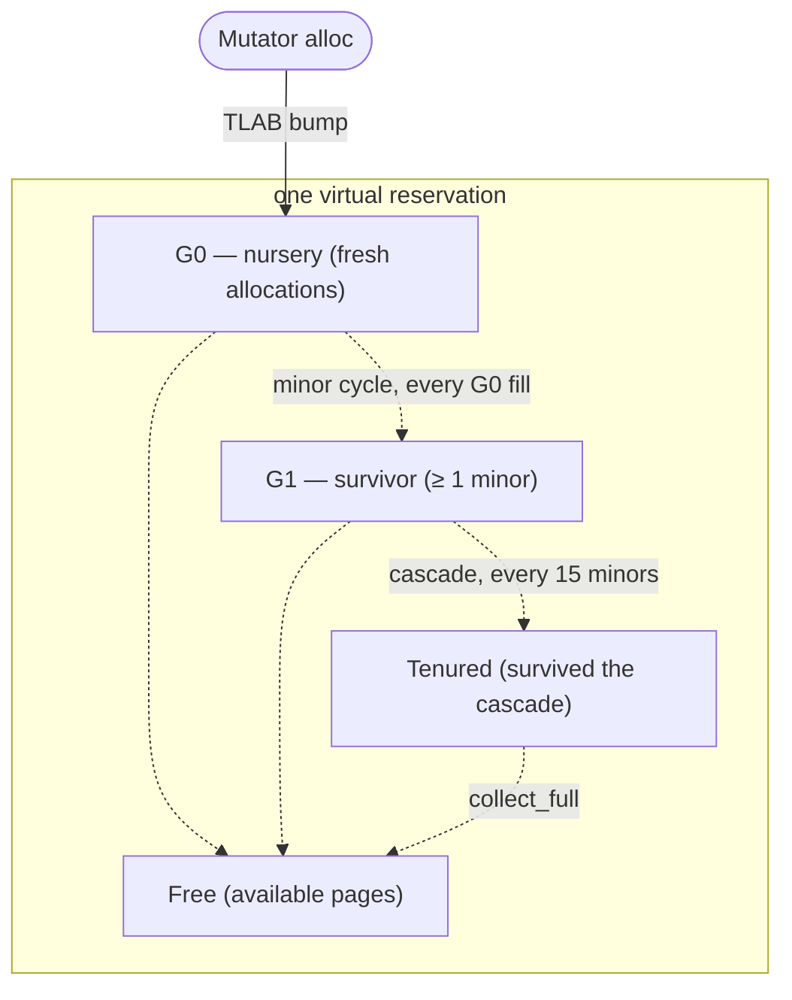
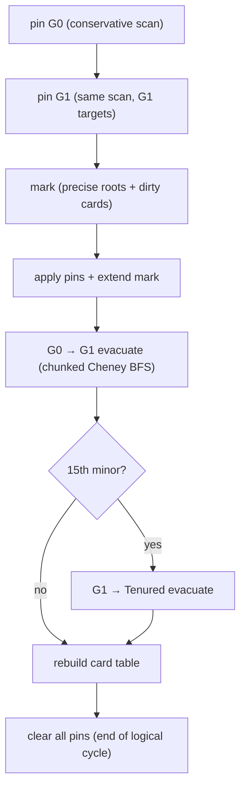
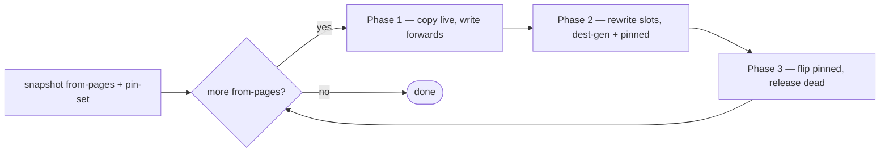
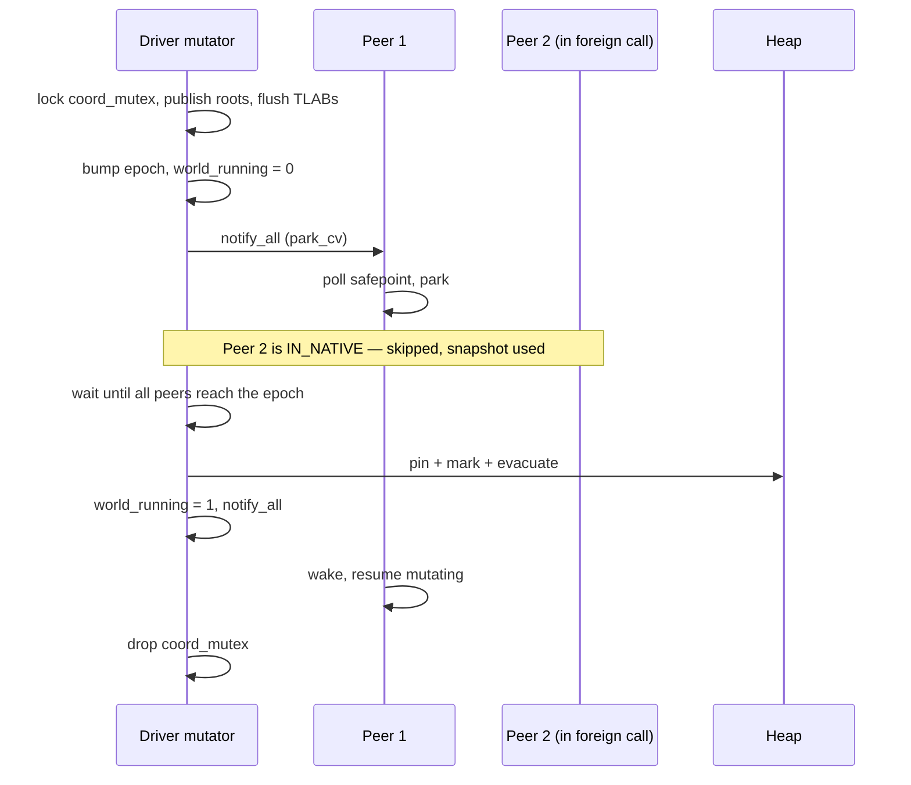

# The garbage collector

NCL ships its own collector. It lives in a separate crate
(`newgc-core`); NCL consumes it as a pinned dependency. This page is
a working tour of what it does, in the order you'd care if you were
debugging it.

## The shape of the heap



One contiguous virtual reservation, split into 64 KB pages. Every
page belongs to one of four generations at any moment: G0 (nursery),
G1 (survivor), Tenured (long-lived), Free. A page is *kind-typed*
too — Cons / Boxed / Large / Free — so the allocator and the marker
can scan each page object-aware without consulting a layout table.

Mutators allocate into thread-local *TLABs* (Thread-Local Allocation
Buffers) carved from G0; the TLAB refill is the only point an
allocator touches the global heap mutex. A 2 MB TLAB amortises that
mutex over thousands of conses.

## The minor cycle

The minor cycle is everything that runs when G0 fills. The user-
visible call is `m.collect_minor(roots, |evac| { ... })`; underneath,
several distinct passes happen.



The cascade is the subtle part. Every 15th minor, the G0→G1 pass is
followed by a G1→Tenured pass *in the same logical cycle*. The
conservative scan runs once at the start, seeding pins for both G0
*and* G1 targets, because mutator stack pointers into G1 still need
protection through the cascade. The cleanup at the bottom — clearing
the per-cycle pin set — runs exactly once, after both sub-evacs.
(Earlier versions cleared pins between sub-evacs, which wiped the G1
pins and silently released live G1 pages; the [bughunt
retrospective](../gc_bughunt_tinyleak.md) tells that story.)

## Evacuation: chunked two-phase

The evacuation pass itself is the heart of every cycle.



The loop runs one *chunk* at a time, where a chunk is a few hundred
source pages bounded by available free pages so Phase 1 can't run
out. Each iteration runs all three phases, then takes the next
chunk. The chunked shape lets a single cycle evacuate more pages
than there are free pages at the moment the cycle started — Phase 3
releases pages back to Free that Phase 1 of the next chunk can
consume.

Pinned objects are never copied. Their pages take the **FLIP** path
in Phase 3: the generation stamp on the page changes (G0 → G1, or
G1 → Tenured), the start bits are preserved for the pinned objects'
extents, and everything else on the page is zeroed. A pinned page is
"promoted in place." Pages without any pins take the **RELEASE**
path: their bytes are zeroed and the page goes back to Free.

## Multi-mutator safepoints

NCL's runtime is multi-threaded; the GC stops the world. The
handshake is epoch-based:



Three subtleties worth knowing about because they're failure modes
for naive collectors:

1. **A mutator in foreign code (a long `extern "C"` call into
   native code) is `IN_NATIVE`.** The driver doesn't wait for it.
   Its published root snapshot is used instead. The mutator's
   *re-entry* through the safepoint barrier parks it if the world
   is stopped.

2. **The coordinator election is CAS.** Several mutators can arrive
   at "I want to collect" simultaneously; one wins `coord_mutex`,
   the others wait. The driver's *becoming-coordinator* transition
   is published under the same lock as the world-stop, so a waiting
   driver always sees a consistent (world-stopped, coordinator-set)
   state on its next wake-up.

3. **Notify always runs under the mutex.** Parked peers `cv.wait`
   without a timeout; if a resume's `world_running = 1` raced its
   own notify, a worker could miss the wake-up. Setting the flag
   under `park_mutex` and notifying inside the same critical section
   removes the race.

## Conservative pinning

NCL uses *precise* roots for the JITted stack frames (the compiler
emits root descriptors), but it scans the host Rust stack
*conservatively* for live pointers into the moving generations.
Conservative scanning is what protects pointers that live in
registers spilled to the stack, in saved RBP slots, or in `Vec`s
the runtime hasn't formally enumerated as roots.

A conservative pin is paid for with one mutex-protected hash-set
insertion and one byte set on the target page's descriptor (a fast
"any pin in this 8 KB region?" check). Phase 3's FLIP path uses the
hash-set to identify exactly which objects to preserve.

The trade-off is that a stale stack slot whose bits *happen* to
look like a heap pointer can pin an unreachable object for one
cycle. This is rare in practice and harmless — the object just
takes one extra cycle to die.

## When does each cycle fire?

The trigger policy is in `space.rs::should_collect`:

- **G0 fill > 90%** → minor cycle.
- **Tenured fill > 70%** → major cycle (`collect_major` — G1 →
  Tenured then G0 → G0).
- **Explicit `(gc)` from Lisp** → full cycle (`collect_full` — G0 →
  G1, G1 → Tenured, Tenured → Tenured compact).

You can inspect what just happened from Lisp:

```lisp
(gc-stats)
;; → (:HEAP-BACKEND PAGE-HEAP :MINOR-GCS 33 :FULL-GCS 0
;;     :BYTES-PROMOTED-TOTAL 93520224 :PEAK-YOUNG-BYTES 8435584 ...)
```

The same plist is what the bughunt retrospective in
[gc_bughunt_tinyleak.md](../gc_bughunt_tinyleak.md) used to confirm
the fix. Most of those fields are diagnostic; the ones you'll look
at most are `:MINOR-GCS`, `:FULL-GCS`, and `:BYTES-PROMOTED-TOTAL`.
