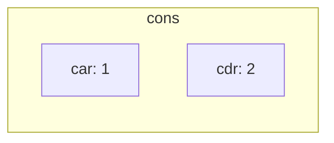
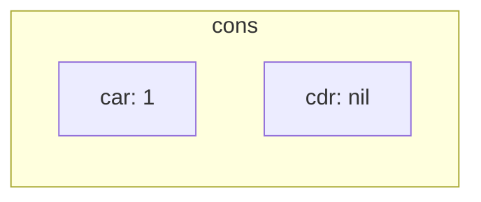
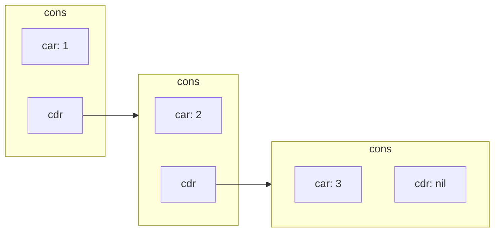

# Lists

Lisp is short for *LISt Processor*, and after sixty-five years the
list is still the data structure the language wears on its sleeve.
A list isn't a magical primitive — it's a chain of two-cell objects
called *cons cells*. Once you see the cells, every list operator in
the language follows.

## The cons cell

A cons cell holds two pointers, called the `car` (the first thing)
and the `cdr` (everything after). `(cons 1 2)` makes one:



`(cons 1 nil)` is a one-element list:



And `(cons 1 (cons 2 (cons 3 nil)))` is a three-element list — a
chain of cons cells, each `cdr` pointing at the next:



That's a list. The reader spells it `(1 2 3)`. The empty list is
`nil`, which is *also* the boolean false — a fact you'll lean on
constantly.

```lisp
> (list 1 2 3)            => (1 2 3)
> (cons 1 (cons 2 (cons 3 nil)))   => (1 2 3)
> nil                     => NIL
> '()                     => NIL
> (null nil)              => T
> (null '(1))             => NIL
```

## Reading the parts

```lisp
> (car '(1 2 3))          => 1
> (cdr '(1 2 3))          => (2 3)
> (first '(1 2 3))        => 1     ; alias for car
> (rest '(1 2 3))         => (2 3) ; alias for cdr
> (second '(1 2 3))       => 2
> (third '(1 2 3))        => 3
> (nth 2 '(a b c d))      => c     ; 0-indexed
> (last '(1 2 3))         => (3)   ; the LAST CONS, not the last element
> (length '(1 2 3))       => 3
```

`car` and `cdr` are the workhorses. The aliases (`first` ... `tenth`,
`rest`) read better in user code; `car`/`cdr` read better when you're
thinking in terms of the cell structure. Both compile to the same
machine instruction.

Combinations of `car` and `cdr` shorten common deep accesses:

```lisp
> (cadr '(1 2 3))         => 2          ; (car (cdr ...))
> (cddr '(1 2 3))         => (3)        ; (cdr (cdr ...))
> (caddr '(1 2 3))        => 3          ; (car (cdr (cdr ...)))
> (cadar '((1 2) (3 4)))  => 2          ; (car (cdr (car ...)))
```

Up to four letters between `c` and `r`. Past that, use `nth` or
`(nth n list)` — it's clearer than `caddddddr`.

## Building lists

```lisp
> (list 1 2 3)            => (1 2 3)
> (list)                  => NIL
> (append '(1 2) '(3 4))  => (1 2 3 4)
> (append '(1) '(2) '(3)) => (1 2 3)
> (cons 1 '(2 3))         => (1 2 3)      ; prepend
> (reverse '(1 2 3))      => (3 2 1)
> (make-list 5)           => (NIL NIL NIL NIL NIL)
> (make-list 5 :initial-element 'a) => (A A A A A)
```

`cons` prepends in O(1); `append` is O(length) of every list but the
last. `reverse` copies. If you're building a list head-first (the
most common pattern), the idiom is:

```lisp
> (defun range (n)
    (let ((acc nil))
      (dotimes (i n) (push i acc))
      (nreverse acc)))
RANGE
> (range 10)              => (0 1 2 3 4 5 6 7 8 9)
```

`push` is `(setq acc (cons x acc))` in macro form. `nreverse` is
the destructive cousin of `reverse` — it reuses the input's cons
cells instead of allocating new ones. Use `nreverse` when you own
the list you're reversing (you just built it, no one else has a
reference); use `reverse` when you don't.

## Mapping

The most common operation on a list is *do something to every element*.
You almost never write `dotimes` for that — you use a mapping
operator.

```lisp
> (mapcar #'1+ '(1 2 3))          => (2 3 4)
> (mapcar #'abs '(-1 0 2))        => (1 0 2)
> (mapcar (lambda (x) (* x x)) '(1 2 3))  => (1 4 9)
> (mapcar #'+ '(1 2 3) '(10 20 30))       => (11 22 33)
> (mapcar #'list '(a b c) '(1 2 3))       => ((A 1) (B 2) (C 3))
```

`mapcar` produces a new list of the results. Its cousins:

- **`mapc`** — like `mapcar` but discards the results; for
  side-effects.
- **`mapcan`** — `mapcar` followed by `nconc`; the function
  returns lists which get spliced together.
- **`maplist`** — like `mapcar` but passes *each cdr* instead of
  *each element*; useful when you want to look at the tail.

The `#'` notation is "function quote" — it grabs the function value
of the symbol. For built-ins like `1+`, `abs`, `+`, you almost
always want `#'`. For one-shot functions, `lambda` is the inline
form: `(lambda (x) (* x x))`.

## Filtering and folding

```lisp
> (remove-if #'evenp '(1 2 3 4 5))         => (1 3 5)
> (remove-if-not #'evenp '(1 2 3 4 5))     => (2 4)
> (find-if (lambda (x) (> x 3)) '(1 2 3 4 5))  => 4
> (count-if #'evenp '(1 2 3 4 5))          => 2
> (every #'numberp '(1 2 3))               => T
> (some #'evenp '(1 3 5))                  => NIL
```

`reduce` (a.k.a. *fold*) collapses a list to a single value:

```lisp
> (reduce #'+ '(1 2 3 4 5))               => 15
> (reduce #'+ '(1 2 3 4 5) :initial-value 100)  => 115
> (reduce #'max '(3 1 4 1 5 9 2 6))       => 9
> (reduce #'list '(1 2 3 4) :initial-value '())  => ((((NIL 1) 2) 3) 4)
```

Most loops over lists can be expressed as a `mapcar` (when you want
a new list), `remove-if` / `find-if` (when you want to filter), or
`reduce` (when you want a summary). Reaching for `dolist` is
appropriate when the work is genuinely imperative (side-effects
during the walk).

## Destructive vs non-destructive

Most list operators have two flavours:

| Non-destructive | Destructive | What                          |
|-----------------|-------------|-------------------------------|
| `append`        | `nconc`     | concatenate                   |
| `reverse`       | `nreverse`  | reverse                       |
| `subst`         | `nsubst`    | substitute                    |
| `remove`        | `delete`    | remove matching items         |
| `union`         | `nunion`    | set union                     |

The destructive ones reuse the input cons cells — they're faster
and produce no garbage, but if anyone else holds a reference to the
input, that reference's contents will mutate underneath them. The
rule of thumb: use the destructive form when you've just built the
list yourself and own all references to it.

## Association lists and property lists

Two list-shaped lookup structures predate hash tables in Lisp:

```lisp
;; Association list — list of (key . value) cons cells.
> (defvar *table* '((a . 1) (b . 2) (c . 3)))
*TABLE*
> (assoc 'b *table*)              => (B . 2)
> (cdr (assoc 'b *table*))        => 2
> (rassoc 2 *table*)              => (B . 2)

;; Property list — flat alternating key/value.
> (defvar *plist* '(:name "alice" :age 30))
*PLIST*
> (getf *plist* :name)            => "alice"
> (getf *plist* :age)             => 30
```

Alists are good for ordered associations, small tables, and when
you want `assoc` to find the *first* matching key. Plists are good
for keyword-argument-style structures and for symbol-attached
metadata (every symbol has a property list you can attach to).

For larger lookups, prefer a real hash table.

## Some idioms worth pinning to your wall

**Build a list in reverse, then reverse it:**

```lisp
(let ((result nil))
  (dolist (x source) (push (f x) result))
  (nreverse result))
```

This is what `mapcar` does internally. Use the explicit form when
the per-element work is more complex than one expression — say, if
you need to skip some elements or emit multiple per input.

**Walk pairs of consecutive elements:**

```lisp
(loop for (a b) on '(1 2 3 4)
      while b
      collect (list a b))
;; => ((1 2) (2 3) (3 4))
```

The `on` clause iterates over successive `cdr`s; pattern-matching
`(a b)` pulls the first two.

**Test a tree (nested lists):**

```lisp
(defun flatten (tree)
  (cond ((null tree) nil)
        ((atom tree) (list tree))
        (t (append (flatten (car tree))
                   (flatten (cdr tree))))))
;; (flatten '((1 (2 3)) 4 (5 (6)))) => (1 2 3 4 5 6)
```

The trio of `null`, `atom`, and recursive descent is the canonical
shape for walking nested lists. Most "do something to every leaf"
problems reduce to this pattern.

## What's next

- **[Numbers](numbers.md)** — the values you put in the cars.
- **[Functions](functions.md)** — defining your own list operators.
- **[Macros](macros.md)** — how `dolist` and `loop` work under the
  hood.
