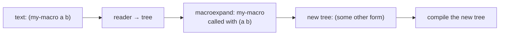

# Macros

A function takes runtime values and returns a runtime value. A
*macro* takes pieces of source code and returns *new pieces of
source code*, which then go on to be compiled. Most of Common
Lisp's surface — `when`, `unless`, `cond`, `loop`, `dotimes`,
`setf`, `defstruct`, every single one of `do`-anything — is built
out of macros over a much smaller core. So is, eventually, your
own program.

## The data is the code

The reader turns text into lists of symbols, numbers, and other
lists. Every CL form is one of those tree-shaped values. A macro
gets to operate on the tree:

```lisp
> '(if (> x 0) (print x) (print 'no))     ; this is just a list
(IF (> X 0) (PRINT X) (PRINT 'NO))

> (first '(if (> x 0) (print x) (print 'no)))
IF
> (third '(if (> x 0) (print x) (print 'no)))
(PRINT X)
```

The list is literally what your program *is*, not just a
representation of it. A macro receives that list, returns a new
list, and the compiler then compiles the new list as if you had
written it.



## `defmacro`

`defmacro` looks like `defun`. The difference: the parameters
receive *pieces of source* (unevaluated), and the body returns
*a piece of source* that will replace the call.

```lisp
> (defmacro my-when (test &body body)
    (list 'if test (cons 'progn body)))
MY-WHEN
> (my-when (> 3 2) (print 'yes) 'done)
YES
DONE
> (macroexpand '(my-when (> 3 2) (print 'yes) 'done))
(IF (> 3 2) (PROGN (PRINT 'YES) 'DONE))
```

`macroexpand` is the introspection tool: it shows you the
*expansion* — what the macro turned its input into. `(my-when test
a b c)` expands to `(if test (progn a b c))`, which is the standard
`when`.

`&body` is the same as `&rest` but a hint to the indenter to format
the trailing arguments as a body block, not an argument list.

## Quasiquotation

Writing `(list 'if test (cons 'progn body))` for every macro is
tedious. Lisp gives you a templating syntax:

- `` ` `` (backquote) — quote this form, *except*
- `,x` (unquote) — splice in the value of `x`
- `,@x` (unquote-splice) — splice in the *contents* of `x`

```lisp
> (defmacro my-when (test &body body)
    `(if ,test (progn ,@body)))
MY-WHEN
> (macroexpand '(my-when (> 3 2) (print 'yes) 'done))
(IF (> 3 2) (PROGN (PRINT 'YES) 'DONE))
```

Read the body as: "produce an `if` form whose first argument is
the value of `test` and whose second argument is a `progn` of the
elements of `body`." `,@body` says "splice these in"; without the
`@` you'd get `(progn ((print 'yes) 'done))`, a list inside the
`progn`.

The quasiquote / unquote pair is so useful that almost every
non-trivial macro uses it.

## A bigger example: `unless` and `with-counter`

```lisp
> (defmacro my-unless (test &body body)
    `(if ,test nil (progn ,@body)))
MY-UNLESS
> (my-unless (zerop 5) (print 'nonzero))
NONZERO
```

A binding macro that introduces a counter for the duration of a
body:

```lisp
> (defmacro with-counter (name &body body)
    `(let ((,name 0))
       (flet ((bump () (incf ,name)))
         ,@body)))
WITH-COUNTER
> (with-counter c
    (dotimes (i 10) (bump))
    c)
10
```

`(with-counter c (dotimes ...))` expands to:

```lisp
(LET ((C 0))
  (FLET ((BUMP () (INCF C)))
    (DOTIMES (I 10) (BUMP))
    C))
```

The user's symbol `c` becomes the bound name; `bump` is the
private incrementor. The body runs with both available.

## Hygiene: `gensym`

Macros can accidentally capture names. Consider:

```lisp
(defmacro twice (form)
  `(progn ,form ,form))
```

Looks fine. But:

```lisp
> (let ((i 0)) (twice (incf i)))     => 2          ; great
> (let ((twice 'oh-no)) (twice (print twice)))     ; uh
```

Worse, a macro that introduces a *named* binding can collide with a
name the user already had:

```lisp
(defmacro broken-swap (a b)
  `(let ((tmp ,a))
     (setf ,a ,b)
     (setf ,b tmp)))

;; Now if the user happens to call swap with tmp:
(let ((x 1) (tmp 2)) (broken-swap x tmp))
;; expands to:
(let ((x 1) (tmp 2))
  (let ((tmp x))            ; shadows the user's tmp!
    (setf x tmp)            ; reads from the macro's tmp
    (setf tmp tmp)))        ; sets the macro's tmp to itself
```

The fix is to never use a name the user might have. `gensym`
produces a guaranteed-fresh symbol — one nothing else in the
program could match — for the macro's private bindings.

```lisp
> (defmacro safe-swap (a b)
    (let ((tmp (gensym "TMP-")))
      `(let ((,tmp ,a))
         (setf ,a ,b)
         (setf ,b ,tmp))))
SAFE-SWAP
> (let ((x 1) (tmp 2))
    (safe-swap x tmp)
    (list x tmp))
(2 1)

> (macroexpand '(safe-swap x tmp))
(LET ((#:TMP-103 X))
  (SETF X TMP)
  (SETF TMP #:TMP-103))
```

`#:TMP-103` is the gensym — it's printed with `#:` to mark it as
uninterned (it lives nowhere in any package), so it can't possibly
clash with a user name.

The rule is: any name a macro introduces as a *binding* should be
a gensym. Names you *insert from the user's input* — like `,a` and
`,b` above — are fine, because they're the user's own.

## When (and when not) to write a macro

Macros earn their keep when:

- The form's *shape* matters more than its values — `with-open-file`,
  `dotimes`, `multiple-value-bind` all take an unevaluated binding
  spec.
- You want to introduce a new control structure — `unless`, `loop`,
  `cond` are all macros.
- You want compile-time work — `defstruct` builds accessors at
  compile time, `defclass` registers metaclass info.
- The same boilerplate keeps showing up and a function won't do
  because the boilerplate involves *binding new names* or
  *delaying evaluation*.

Macros do NOT earn their keep when:

- You just want abstraction over values — that's what *functions*
  are for. A function is easier to compose, debug, trace, replace,
  and reason about.
- You're trying to "save typing." Macros that exist only to be
  shorter usually waste more debugging time than they save typing.

Reach for a function first. Promote to a macro when the function
won't cut it.

## A taste of what's possible

Most of CL's iteration vocabulary is just macros over the lower-
level `block` / `tagbody` / `go` machinery. Walk through what
`when` is built out of:

```lisp
(when (foo) (bar) (baz))
;; expands to:
(if (foo) (progn (bar) (baz)))
```

What `dolist` is built out of (sketch):

```lisp
(dolist (x '(1 2 3)) (print x))
;; expands to something like:
(block nil
  (let ((tail '(1 2 3)))
    (tagbody
       loop
         (when (null tail) (return nil))
         (let ((x (car tail)))
           (print x))
         (setf tail (cdr tail))
         (go loop))))
```

What `cond` is built out of:

```lisp
(cond ((a) 1) ((b) 2) (t 3))
;; expands to:
(if (a) 1
    (if (b) 2
        (if t 3)))
```

You could write `dolist`, `cond`, `when`, `unless`, even `or` and
`and`, in user code — they don't have to be primitives. In CL they
*aren't* primitives; they're macros, and `macroexpand` will show
you exactly how each one is built.

```lisp
> (macroexpand '(when test a b c))
(IF TEST (PROGN A B C))

> (macroexpand '(cond ((a) 1) ((b) 2) (t 3)))
(IF (A) 1 (IF (B) 2 (IF T 3)))
```

This is the one trick: code is data, so a macro is a program that
writes programs.

## What's next

- **[Functions](functions.md)** — what `lambda` is at runtime;
  macros generate `lambda`-bearing source.
- **[Control flow](control-flow.md)** — most of the forms there
  are macros built on `if`, `block`, and `tagbody`.
- **[Variables](variables.md)** — `setf` and `incf` are macros
  too, and `gensym` is exactly the tool you use to write your own.
