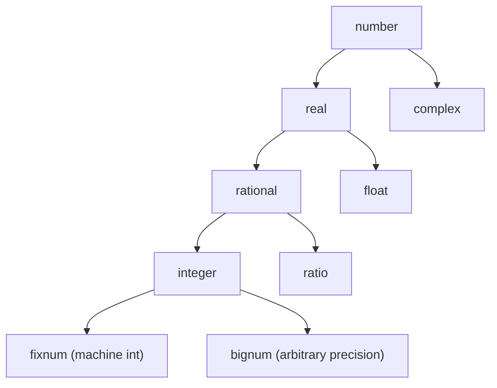

# Numbers

Common Lisp has the richest numeric tower of any mainstream language.
NCL implements all of it: small machine integers, arbitrary-precision
integers (bignums), exact rationals, double-precision floats, and
complex numbers — under one set of arithmetic operators that promote
automatically.

## The type tower



Read top to bottom: a `fixnum` is an `integer` is a `rational` is a
`real` is a `number`. Every operator that works on one level works
on the level above. `(+ 1 1/2)` is fine — fixnum plus ratio promotes
to ratio.

You ask which level a value is at with the type predicates:

```lisp
> (numberp 42)            => T
> (integerp 1/2)          => NIL
> (rationalp 1/2)         => T
> (floatp 3.14)           => T
> (complexp #C(1 2))      => T
> (typep 42 'fixnum)      => T
```

## Reading numbers

The reader recognises:

| Surface  | Becomes        | Notes                                    |
|----------|----------------|------------------------------------------|
| `42`     | integer (fixnum) | base-10 by default                     |
| `-3`     | integer        | sign optional                            |
| `1/2`    | ratio          | reduced automatically: `4/8` reads as `1/2` |
| `3.14`   | double-float   | NCL uses double precision throughout     |
| `1e6`    | double-float   | `1000000.0`                              |
| `#x1A`   | integer        | hex                                      |
| `#o17`   | integer        | octal                                    |
| `#b1011` | integer        | binary                                   |
| `#C(1 2)` | complex       | real and imaginary parts                 |

Bignums have no surface syntax — they're integers that simply got too
big for a machine word. `(expt 2 100)` reads in as `100`, evaluates
to a bignum.

## Arithmetic that just works

```lisp
> (+ 1 2 3 4)            => 10
> (* 1 2 3 4)            => 24
> (- 10 1 2 3)           => 4
> (/ 1 3)                => 1/3       ; stays exact!
> (/ 1.0 3)              => 0.3333333333333333
> (expt 2 100)           => 1267650600228229401496703205376
> (mod 17 5)             => 2
> (rem 17 5)             => 2
> (gcd 12 18)            => 6
> (lcm 4 6)              => 12
```

`/` is the surprise for everyone arriving from C-family languages.
`(/ 1 3)` is exact: it returns the ratio `1/3`, not `0`. If you want
floating-point division, give it a float: `(/ 1.0 3)`. If you want
integer division (the truncated quotient), use `floor`, `truncate`,
`ceiling`, or `round` — each returns two values, the quotient and
the remainder:

```lisp
> (floor 17 5)            => 3, 2     ; 3 remainder 2
> (truncate -17 5)        => -3, -2   ; rounds toward zero
> (ceiling 17 5)          => 4, -3
> (round 25 4)            => 6, 1     ; banker's rounding
```

When you need just the quotient, wrap it in `multiple-value-bind` or
take the first value:

```lisp
> (multiple-value-bind (q r) (floor 17 5)
    (format t "~A r ~A" q r))
3 r 2
```

## Bignums are automatic

There is no `BigInteger` type to opt into. The runtime watches the
arithmetic operators and promotes when a result no longer fits in a
machine word:

```lisp
> (defun fact (n) (if (zerop n) 1 (* n (fact (- n 1)))))
FACT
> (fact 20)               => 2432902008176640000        ; fixnum
> (fact 21)               => 51090942171709440000       ; now bignum
> (fact 100)              => 93326215443944152681699238856266700490715968264381621468592963895217599993229915608941463976156518286253697920827223758251185210916864000000000000000000000000
```

The transition is invisible to your code. NCL stores the limb data
inside its own heap, so the GC sees those bytes and reclaims them
when the bignum becomes unreachable — there's no `BigInt` you have
to drop.

## Comparisons

The comparison operators accept any number of arguments and check
the relation pairwise:

```lisp
> (= 1 1 1)               => T
> (< 1 2 3)               => T            ; strictly ascending
> (< 1 2 2)               => NIL
> (<= 1 2 2)              => T
> (> 3 2 1)               => T
> (/= 1 2 1)              => NIL          ; "no two are equal"
> (= 1 1.0 1/1)           => T            ; cross-type comparison
```

Use `=` for numeric equality (which compares values across types) and
`eql` / `equal` for the stricter object-identity comparisons that
also work on non-numbers.

## Floats, exactness, and contagion

A computation involving a float yields a float. This is *contagion*:
the imprecise type dominates.

```lisp
> (+ 1 2)                 => 3            ; integer
> (+ 1 2.0)               => 3.0          ; one float makes the result a float
> (+ 1/2 1/3)             => 5/6          ; both exact, stays exact
> (+ 1/2 0.5)             => 1.0          ; ratio meets float, becomes float
```

The principle: NCL gives you the *most informative* type available.
Two exact inputs produce an exact output; once a float enters, the
result is float because precision was already lost.

To force a conversion:

```lisp
> (float 1/3)             => 0.3333333333333333
> (rationalize 0.1)       => 3602879701896397/36028797018963968
> (truncate 3.14)         => 3, 0.14000000000000012
> (coerce 1 'float)       => 1.0
```

## Negative numbers and absolute value

```lisp
> (- 5)                   => -5           ; unary minus, negate
> (abs -5)                => 5
> (signum -5)             => -1
> (signum 0)              => 0
> (signum 7.5)            => 1.0          ; sign of a float is a float
> (max 1 2 3)             => 3
> (min 1 2 3)             => 1
```

## Common utilities

```lisp
> (1+ 5)                  => 6            ; n + 1
> (1- 5)                  => 4            ; n - 1
> (zerop 0)               => T
> (plusp 5)               => T
> (minusp -5)             => T
> (oddp 3)                => T
> (evenp 4)               => T
> (expt 2 10)             => 1024
> (sqrt 2)                => 1.4142135623730951
> (sqrt -1)               => #C(0 1)      ; complex result
> (log 100 10)            => 2.0
> (sin 0)                 => 0.0
```

`sqrt` returns a complex number when its argument is negative — the
type tower lets it do that without you opting in.

## When precision matters

For exact computation, stay in rationals:

```lisp
> (let ((sum 0))
    (dotimes (i 100) (incf sum (/ 1 (1+ i))))
    sum)
14466636279520351160221518043104131447711/3099044504245996706400
```

That's the harmonic sum H₁₀₀ as an exact fraction. Convert to a float
at the *end* if you need to display it:

```lisp
> (float
    (let ((sum 0))
      (dotimes (i 100) (incf sum (/ 1 (1+ i))))
      sum))
5.187377517639621
```

The pattern — exact arithmetic everywhere, `float` only at the
boundary — gets you correctness for free in places where Python's
`Decimal` or Java's `BigDecimal` would cost both code and effort.

## What's next

- **[Lists](lists.md)** — the data structure Lisp is named after.
- **[Variables and bindings](variables.md)** — where to put the
  numbers you just computed.
- **[Functions](functions.md)** — defining your own operators.
