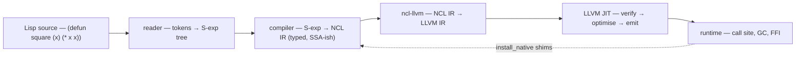

# The pipeline

What happens between a `.lisp` source file and a running expression.

NCL is a *compiler*, not an interpreter — every form you submit, at
the REPL or in a file, walks the whole pipeline before running. The
front end and the runtime are both Rust; LLVM does the codegen. Lisp
forms become LLVM IR, which becomes machine code, which calls back
into a thin Rust runtime that owns the heap and the symbol tables.

## The path of a form

Five hops, plus a feedback loop where the runtime installs native
Rust shims as ordinary Lisp functions so the compiler can resolve
them by name.

### 1. Reader

The reader takes characters and produces a tree of S-expressions. It
handles the usual Common Lisp surface — `'`, `` ` ``, `,`, `,@`,
character literals, `#(...)` vectors, `#\Newline`, `#'fn`. It is
deliberately small; the lexer in `ncl-reader` is a hand-written state
machine, not a parser-generator, because reader macros and Lisp's
weird-by-design tokenisation make table-driven approaches more pain
than they're worth.

### 2. Compiler

`ncl-compiler` turns each S-expression into an NCL IR program. NCL
IR is its own intermediate language — typed enough to drive useful
codegen, untyped where the user hasn't promised anything. The
compiler does the conventional Lisp lowering work: macroexpansion,
special-form handling, let/let*, closure capture analysis, lambda
lifting, constant folding where it's safe.

The IR carries enough type information for the LLVM stage to pick
unboxed paths when possible. A `(+ x y)` where the compiler proves
both operands are fixnums emits direct integer arithmetic; an `(+ x
y)` over arbitrary values goes through `ncl_add` in the runtime.

### 3. ncl-llvm

`ncl-llvm` translates NCL IR into LLVM IR. This is the bridge: each
NCL IR opcode has a translation rule, calling conventions are pinned
to Rust's `extern "C-unwind"`, and the result is a `.ll`-shaped module
the LLVM JIT can verify and run.

The boundary between NCL IR and LLVM IR exists because LLVM IR is
*low-level* — a single NCL `defun` produces dozens of LLVM
instructions. Keeping a separate IR layer lets the compiler reason
about Lisp at Lisp's level (closures, multiple values, tail calls)
without baking those concepts into how LLVM sees them.

### 4. LLVM JIT

Standard LLVM JIT flow — `MCJIT` / ORC, the verifier runs, the
optimiser runs, machine code lands in mappable pages, and the
runtime gets a `*const u8` it can call. NCL doesn't ship a slow
interpreter and a fast tier; every form is JIT-compiled, every time.
That is occasionally surprising at the REPL (a one-line `defun`
takes a few milliseconds longer than you'd expect), and it is always
a relief once the form starts looping.

### 5. Runtime

`ncl-runtime` is the Rust layer the JITted code calls into.
Allocations land in a `Mutator`'s thread-local TLAB; the TLAB
refills against a multi-mutator `GcCoordinator` that owns the
page-heap and the safepoint protocol. The runtime owns:

- the **page heap** (newgc-core) — generations, conservative pins,
  cascade promotion, mid-evac OOM (see [The GC](gc.md))
- the **static area** — interned symbols, the global value cell
  table, FFI-pinned objects
- the **dispatch tables** — `install_native` connects a Rust
  function pointer to a Lisp symbol's function cell
- the **GUI bridge** — the integrated window, editor, REPL, doc
  pane (this manual is one)

### The feedback loop

The dashed arrow on the diagram closes the cycle. The compiler
emits calls by name (`*`, `cons`, `print-object`); those names
resolve at link time to either a JIT-compiled Lisp function or a
Rust shim the runtime registered at startup. The reader, the
compiler, and the runtime all share one symbol table — when a form
references `cons`, every layer agrees on which symbol that is.

## What it isn't

There is no bytecode tier, no AST interpreter, no two-stage compile.
There is also no static type checker — the IR is typed *where the
compiler can prove it*; everywhere else, code falls back to the
boxed runtime helpers and the program runs anyway. NCL chooses
"always JIT, sometimes dynamic" over "fast static dialect, slow
when you escape the proofs."

The trade-off is real: a Lisp file with no type hints runs more
boxed allocations than the same program with `(declare (type fixnum
n))`. The benefit is that you can write `(defun fact (n) (if (zerop
n) 1 (* n (fact (- n 1)))))` and have it just *work*, on bignums
when `n` gets large, without writing a separate dispatch.
