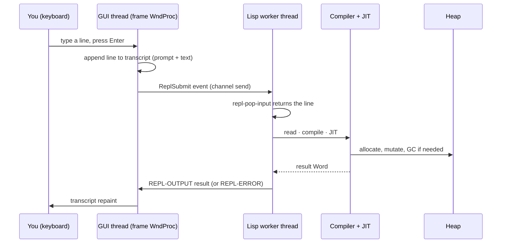

# The integrated REPL

NCL ships a REPL pane that lives inside the editor window. It's not
a terminal-emulator wrapper around an external `ncl.exe`; it's a
native MDI child with its own Direct2D-rendered transcript view and
a one-line editor docked at the bottom. The transcript and the input
field share font metrics with the editor, so output, prompts, and
your in-progress line look identical.

## The conversation



The split is the design's central choice: the **GUI thread** runs
the Win32 message pump and never touches the heap; the **Lisp
worker** does compilation, evaluation, and any GC the form
triggers; an **MPSC channel** carries events between them. Two
benefits fall out:

1. **The window stays responsive while a `(loop)` runs.** The GUI
   thread keeps painting, keeps handling input, keeps closing
   menus. The Lisp worker is what's busy; nothing on the UI thread
   waits on it.

2. **A GC pause stops *only* the Lisp worker.** The doc viewer
   scrolls smoothly during a `(gc)`, the editor's caret keeps
   blinking, even the REPL's own transcript stays repaintable. The
   pane that stops is the prompt — and that's the one you expect to
   pause while it works.

## What's where

The REPL pane is `igui::repl_child`. It owns:

- A **rope-backed transcript** — same `RopeBuffer` the editor uses,
  same insert/append/find primitives. Output, prompts, and error
  text are inserted as styled runs.
- An **input row** — a single-line `ledit`-shaped editor, with
  history (up/down) and basic editing keys.
- An **input queue** — a small FIFO the worker drains via
  `(repl-pop-input child-id)`. This decouples the GUI from the
  worker: type three forms quickly while one is still running and
  they queue.

The worker side is plain Lisp:

```lisp
(defun repl-loop ()
  (let ((pane (open-repl-window "NCL REPL")))
    (loop
      (let ((line (next-input pane)))
        (handler-case
            (let ((result (eval (read-from-string line))))
              (repl-output pane (write-to-string result)))
          (error (c)
            (repl-error pane (princ-to-string c))))))))
```

`next-input` is a thin loop around `(next-event)` that filters for
`ReplSubmit` events and pops the input from the matching pane.
`repl-output` and `repl-error` are the two output paths; both append
a styled run to the transcript and post a repaint.

## Multiple panes

Each call to `(open-repl-window TITLE)` opens a fresh, independent
pane. They don't share input queues, they don't share history,
they share only the *Session* — the global environment, the symbol
table, the heap. Two REPLs side by side are useful for talking to
the same image from two viewpoints: one in a `(loop)` driving a
demo, the other interactive to poke at state.

This is also why the pane is *multiply instantiable*. The
documentation pane you're reading and a REPL pane and the editor
window for a `.lisp` file you're working on are all peers in the
same MDI frame. You can drag them, tile them, and minimise them
independently.

## Why not a terminal?

It would be easier to fork `ncl.exe` under conhost and call it
done. Two reasons not to:

**Threading.** A real terminal is a stream of bytes. NCL's worker
needs to deliver structured *events* (a click that opened a pane, a
key that submitted a line, a `(quit)` that asked for shutdown), and
the GUI needs to update structured *views* (the editor's caret, the
REPL's transcript, a doc pane's Markdown). Wire-format text would
work for the worker → GUI path but not for the GUI → worker path
without re-implementing a reader on top of an escape-coded stream.

**Identity.** Drag-and-drop a `.lisp` file onto the frame and the
file opens in an editor pane. Right-click in the REPL and the
context menu *understands* what an S-expression is. Hover a symbol
in the editor and the inspector tells you what it is. None of that
is possible if the worker writes bytes to a stream the GUI
reluctantly interprets.

A terminal is the right interface for the language you're talking
*through*. The integrated REPL is the right interface for the
language you're talking *with*.
