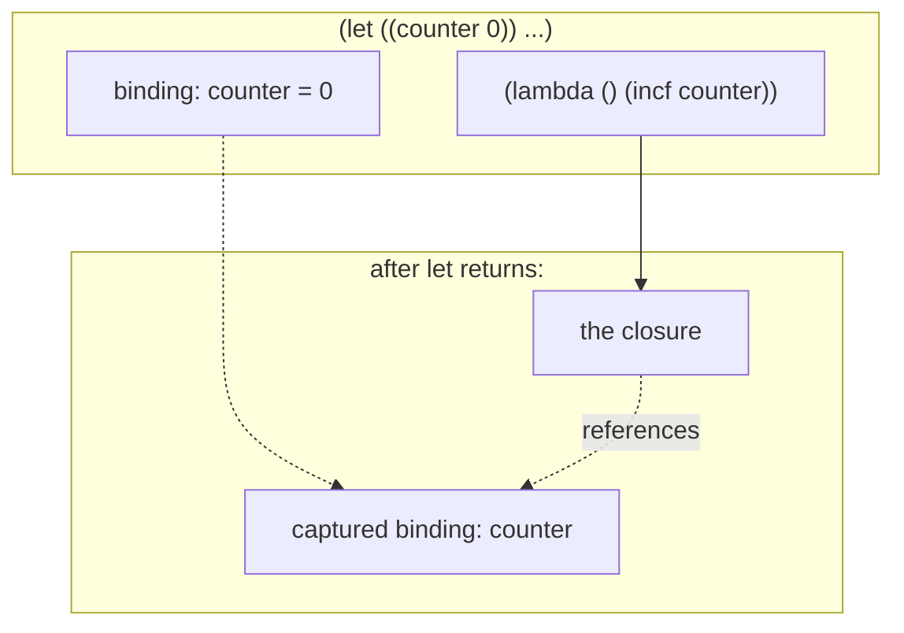
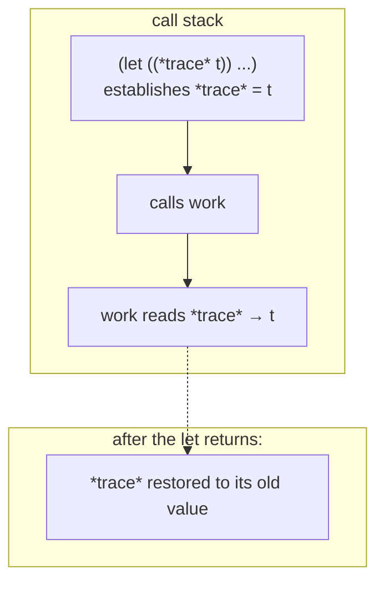
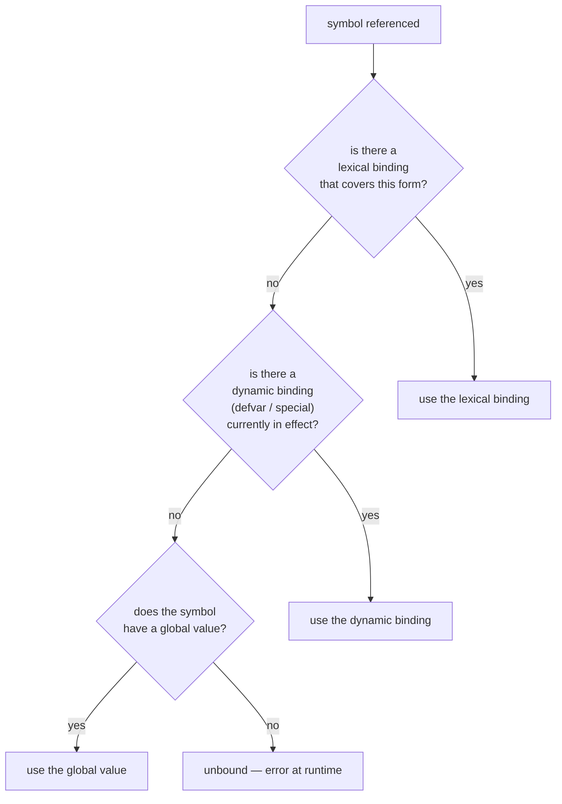

# Variables and bindings

A *binding* is the association between a name and a value. Lisp has
two scoping disciplines — **lexical** and **dynamic** — and a small
set of operators that create or change bindings under each. Mixing
the two is a feature, not a hazard, once you know which is which.

## Lexical scope: the default

A variable bound by `let`, `let*`, or a function parameter is
*lexical*. It's visible inside the form that introduced it, and
nowhere else. That's it — there's no surprise at runtime.

```lisp
> (let ((x 10) (y 20))
    (+ x y))
30
> x   ;; nothing — x doesn't exist here
;; ERROR: unbound variable x
```

`let` binds in parallel; `let*` binds sequentially (later bindings
can see earlier ones):

```lisp
> (let ((x 10) (y (* x 2)))  ; ERROR: x not visible to y in let
    ...)
> (let* ((x 10) (y (* x 2)))
    (+ x y))
30
```

A function parameter is a `let`-binding-in-disguise:

```lisp
> (defun area (w h) (* w h))
AREA
> (area 3 4)              => 12
```

`w` and `h` exist for the duration of the call; they are gone when
`area` returns.

## Closures: bindings outlive their forms

The lexical bindings a function sees aren't tied to *when* the
function runs — they're tied to *where* the function was defined.
A function that references an outer `let`-binding *captures* it:



```lisp
> (defun make-counter ()
    (let ((counter 0))
      (lambda () (incf counter))))
MAKE-COUNTER
> (defvar tick (make-counter))
TICK
> (funcall tick)          => 1
> (funcall tick)          => 2
> (funcall tick)          => 3
```

The `let` has long since returned, but the binding lives because
the closure references it. Each call to `make-counter` produces a
fresh, independent counter. Closures are the simplest object
system, and they predate object systems by twenty years.

## Globals: `defvar` and `defparameter`

A *global* variable is established at the top level with `defvar`
or `defparameter`. By convention (and the only convention every CL
program follows), global names are wrapped in asterisks —
`*my-counter*`, `*log-stream*` — as a visual reminder.

```lisp
> (defparameter *threshold* 100)
*THRESHOLD*
> *threshold*             => 100
> (setf *threshold* 200)  => 200
> *threshold*             => 200
```

The difference between the two:

| Operator         | If already bound                          |
|------------------|-------------------------------------------|
| `defvar`         | Leaves the existing value alone           |
| `defparameter`   | Overwrites with the new value             |

Use `defvar` for values that should survive a re-load (a connection
pool, a cache). Use `defparameter` for values you *want* a re-load
to reset (a tuning knob you're playing with).

The reason globals are special is that they get the *other*
scoping discipline — dynamic scope.

## Dynamic scope: `defvar` and `let` together

When you `let`-bind a global (a `defvar`'d name), you don't shadow
it with a new lexical binding — you *temporarily change its value*
for the duration of the form. Every function called during that
form sees the new value, no matter how deeply nested.

```lisp
> (defvar *trace* nil)
*TRACE*
> (defun work () (when *trace* (format t "working~%")) 42)
WORK
> (work)                  => 42       ; no print
> (let ((*trace* t))
    (work))
working
42
> (work)                  => 42       ; back to silent
```

The `let` of a global gave `work` a different `*trace*` for one
call, then restored the old value. `work` didn't take a parameter;
no plumbing was needed. This is *dynamic binding*, and it's the
killer feature for cross-cutting concerns: configuration, logging,
output streams, the current package, the current pretty-printer.

The CL standard uses dynamic variables for everything that "the
program as a whole" needs to share: `*standard-output*`,
`*print-base*`, `*package*`.



The bind/restore is automatic and exception-safe; even if `work`
calls `error`, the unwind restores `*trace*`.

## Assignment: `setf` is the universal setter

`setf` is the *setter macro*. Whatever you'd evaluate to read a
place, give it to `setf` (along with the new value) and it
becomes a write to the same place:

```lisp
> (defvar *x* 10)
*X*
> (setf *x* 20)           => 20

> (let ((p (list 1 2 3)))
    (setf (car p) 'a)
    (setf (third p) 'c)
    p)
(A 2 C)

> (let ((h (make-hash-table)))
    (setf (gethash 'name h) "alice")
    (gethash 'name h))
"alice"

> (let ((v (vector 1 2 3)))
    (setf (aref v 1) 'x)
    v)
#(1 X 3)
```

`(setf (car p) ...)`, `(setf (gethash ...) ...)`, `(setf (aref ...) ...)`
— these all work because each accessor (`car`, `gethash`, `aref`)
has a matching `setf` expander. Your own functions can do the same:

```lisp
> (defstruct point x y)
POINT
> (let ((p (make-point :x 1 :y 2)))
    (setf (point-x p) 10)
    p)
#S(POINT :X 10 :Y 2)
```

`defstruct` auto-generates `point-x` and `(setf point-x)` for you.

The older operator `setq` only handles plain variables — `(setq x
10)`. Use `setf` everywhere; it does what `setq` does *and* more.

## Increment and decrement

```lisp
> (let ((n 0))
    (incf n)        ; n = n + 1
    (incf n 5)      ; n = n + 5
    (decf n 2)      ; n = n - 2
    n)
4

> (let ((p (list 1 2 3)))
    (incf (car p))
    p)
(2 2 3)
```

`incf` and `decf` are `setf` patterns in disguise: `(incf x n)` is
`(setf x (+ x n))`. Like `setf`, they work on any setf-able place.

## Constants

```lisp
> (defconstant +pi+ 3.141592653589793)
+PI+
> +pi+                    => 3.141592653589793
> (setf +pi+ 3)
;; ERROR: cannot change the value of constant +PI+
```

Constants by convention wear `+plus-signs+`. Reassigning them is an
error. The compiler is allowed to inline their values at every use
site, so an after-the-fact `setf` would produce inconsistent
results anyway — better to refuse.

## Scope summary

A name written down somewhere in your program resolves like this:



The compiler resolves lexical references at compile time — they
become pointer-loads from a stack slot or a closed-over slot.
Dynamic and global references happen at runtime through the symbol's
value cell.

## What's next

- **[Functions](functions.md)** — lambda lists, closures up close.
- **[Control flow](control-flow.md)** — `let` is one of many
  forms that bind locally.
- **[Macros](macros.md)** — how `incf`, `setf`, and friends are
  built.
